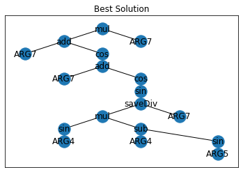
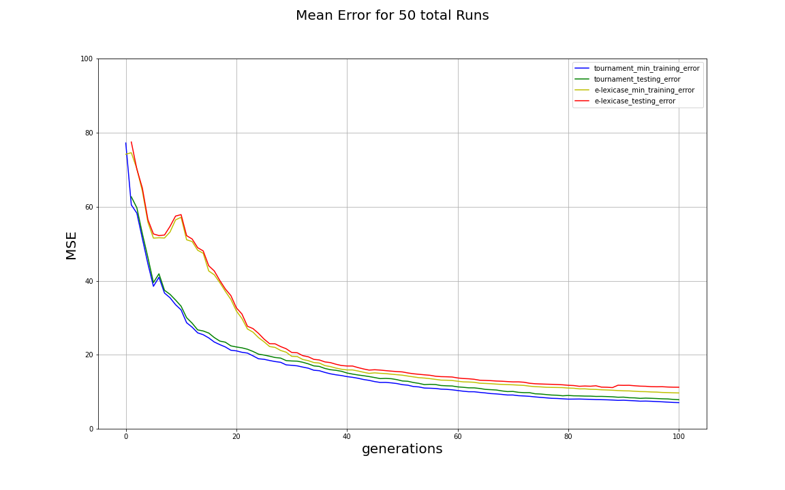

```{r setup, include=FALSE}
library(kableExtra)
library(magrittr)
knitr::opts_chunk$set(echo = TRUE)
```


# Introduction

## Research Question

* Does the usage of $\epsilon$-lexicase parent selection influence the generalization behaviour of genetic programming in symbolic regression if compared to tournament selection?

## Genetic Programming 

* A metaheuristic that searches for computer programs that solve a given problem
* Inventor: John R. Koza ^[@koza_main]
* Evolutionary algorithm that simulates the process of Darwinian evolution:
  1. Population based
  2. The quality of solutions is evaluated by a fitness function
  3. Selection: Solutions are selected based on their individual fitness
  4. Variation: Mutation and recombination of solutions
* Unique Features:
  * Evolve solutions of variable length and structure
  * Solutions are typically represented by recursive tree structures


## Parent Selection

* Operator that selects individual solutions from the population for reproduction and mutation
* Most commonly used selection operator in Genetic Programming (GP): Tournament selection^[@10.1007/978-3-642-16493-4_19, p.181]
* Intuition: High chance for "generalist" solutions to be selected since it is based on aggregated fitness scores

## epsilon-Lexicase Selection

* Recent alternative: Lexicase Selection and it's variation $\epsilon$-lexicase selection
* Idea: Selection method for uncompromising, continous-valued symbolic regression problems ^[@6920034, p.12]
* Increases genetic diversity inside the population^[@6920034, p.1]
* Higher chance for "specialist" solutions to be selected since it is decided on a per case basis
* Performance increases have been demonstrated in many benchmarking problems ^[@epsilon_lexicase_main, p.744-745]


## Symbolic Regression

* Task: Find a mathematical model that fits a given set of datapoints
* One of the first applications of GP described by @koza_main
* High relevance: GP can outperform state-of-the-art machine learning algorithms like gradient boosting ^[@Orzechowski_2018]

## Generalization

* The ability of a model to perform well on previously unseen fitness cases
* Main objective in most supervised machine learning problems
* Challenge: Avoid overfitting to training data

## Motivation

* Little attention has been paid to generalization in GP ^[@open_issues_gp, @generalisation_in_gp]
* High practical relevance of symbolic regression in many fields, e.g. financial forecasting


# Experimental Study


## Benchmark problem

UC Irvine Machine Learning Repository: Prediction of energy efficiency in buildings ^[@Dua:2019]

```{r echo=FALSE, message=FALSE, warning=FALSE, paged.print=TRUE}
fig.pos="H"

knitr::kable(
  read.csv("../tables/csv/variables_energy_heating.csv"),
  digits=3,
  caption="Overview - Energy Heating data set"
) 
```


## Experiment

### Single run

* Total dataset ($N=768$) is randomly split into a training and testing dataset (50:50)
* Fitness metric: Mean squared Error (MSE)
* Train two models using GP with the training dataset only, one using tournament selection and the other $\epsilon$-lexicase selection
* For each generation: Select elite model and compute its fitness for the testing dataset

### Full experiment

* Stochastic algorithm: Repeat the basic experiment for 50 total runs
* Collect and aggregate results for training error, testing error and program length


## Evolutionary Parameters

```{r echo=FALSE, message=FALSE, warning=FALSE, paged.print=TRUE}
fig.pos="H"

knitr::kable(
  read.csv("../tables/csv/gp_parameters.csv"),
  digits=3,
  caption="Evolutionary Parameters"
)
```

## Function Set

```{r echo=FALSE, message=FALSE, warning=FALSE, paged.print=TRUE}
fig.pos="b"

knitr::kable(
  read.csv("../tables/csv/primitives.csv"),
  digits=3,
) 
```

## Terminal Set

```{r echo=FALSE, message=FALSE, warning=FALSE, paged.print=TRUE}
fig.pos="t"

knitr::kable(
  read.csv("../tables/csv/terminals.csv"),
  digits=3,
) 
```

## Example

Model evolved by tournament selection after 100 generations:




## Research Question

* Does the usage of $\epsilon$-lexicase parent selection influence the generalization behavior of genetic programming in symbolic regression if compared to tournament selection?

### 3 Questions

1. Differences in average fitness for both algorithms?
2. Differences in fitness for training and testing data?
3. Differences in program size?


# Results


## Distribution of Fitness


## Finding 1

* The differences in average fitness of the final solutions between tournament selection and $\epsilon$-lexicase selection are highly statistical significant ($\alpha=0.01$)
* Tournament selection-based GP achieves a higher fitness for both training and testing data
* Unexpected results based on the reviewed literature [@epsilon_lexicase_main], [@https://doi.org/10.48550/arxiv.1709.05394]


## Evolution of Fitness




## Finding 2

* The gap between training and testing error is not statistically significant for both selection algorithms
* Both algorithms achieve a slightly better performance for the training data
* No proof for overfitting


## Statistical Test

```{r, echo=FALSE, warning=FALSE}

df <- read.csv("../tables/csv/mwu_matrix_error.csv")

knitr::kable(
  df,
  format = "latex",
  booktabs = TRUE,
  digits=3,
  caption="Mean Error - P-Values (MWU)"
) 

```

## Evolution of Size

\begin{figure}
\centering
\includegraphics{../plots/size_subplotted.png}
\end{figure}


## Finding 3

...

# Conclusions


...

# Limitations and open Questions

...
\newpage


